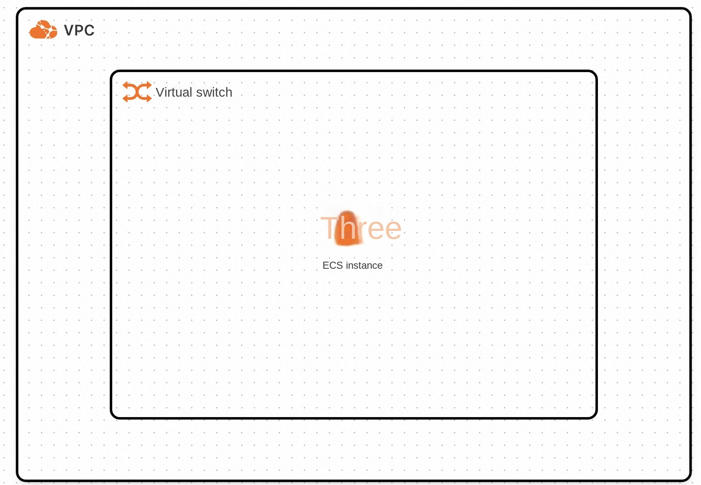
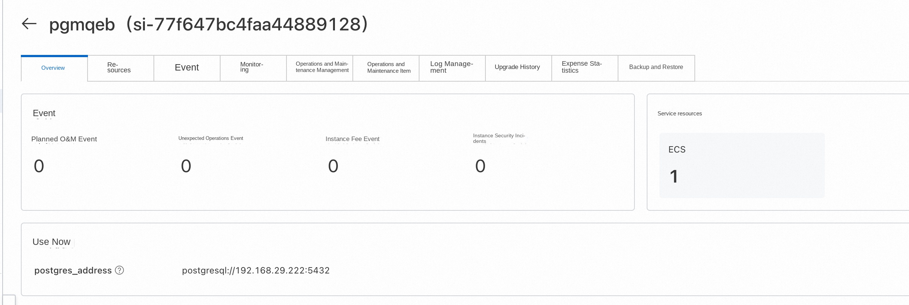
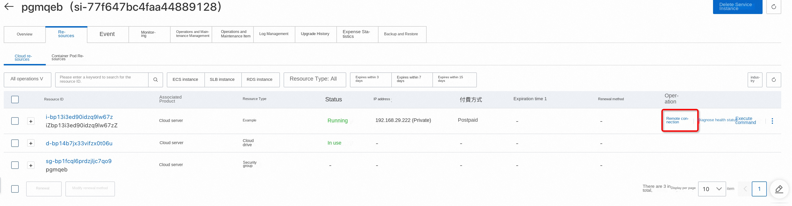
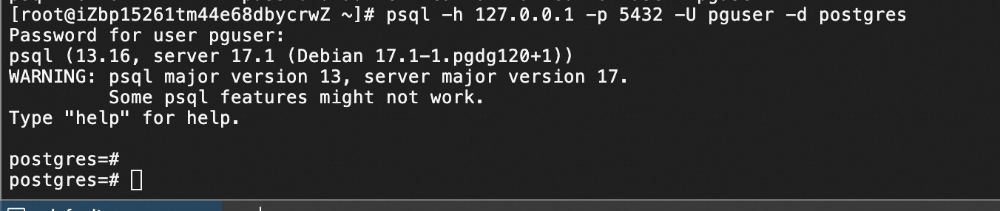

# PostgreSQL Service Instance Deployment Document

## PostgreSQL Introduction
PostgreSQL is a very complete features of free software object-relational database management system (ORDBMS), is developed by the University of California Department of Computer Science POSTGRES,4.2 version of the object-based relational database management system. Many of POSTGRES leading concepts only appeared in the commercial website database at a relatively late stage. PostgreSQL supports most of the SQL standards and provides many other modern features, such as complex queries, foreign keys, triggers, views, transactional integrity, and multi-version concurrency control. Likewise, PostgreSQL can be extended in many ways, such as by adding new data types, functions, operators, aggregate functions, indexing methods, procedural languages, and so on. In addition, because of the flexibility of the license, anyone can use, modify and distribute the PostgreSQL for free for any purpose.

## Billing Description
PostgreSQL fees on Alibaba Cloud are mainly related:
* Specifications of the selected CPU cloud server
* Disk Capacity
Billing method: pay by volume (hour) or package year and month
The estimated cost is displayed in real time when you create an instance.

## Deployment Architecture

The deployment architecture adopts ECS (cloud server) stand-alone deployment

## Required Permissions for RAM Users

| Permission policy name | Comment |
| ------------------------------------- | -------------------- |
| AliyunECSFullAccess | Permissions to manage ECS instances |
| AliyunVPCFullAccess | Permissions to manage a VPC |
| AliyunROSFullAccess | Manage permissions for Resource Orchestration Service (ROS) |
| AliyunComputeNestUserFullAccess | Manage user-side permissions for the compute nest service (ComputeNest) |

## Deployment process

### Deployment Steps

1. Click the deployment link to enter the service instance deployment interface, and fill in the parameters according to the interface prompts to complete the deployment.
2. After completing the parameters, you can see the corresponding inquiry details. After confirming the parameters, click **Next: Confirm Order**
! much)
! much)
3. Confirm the order and agree to the service agreement and click **Create Now**
4. After the deployment is completed, you can start using the service. Enter the service instance details and click Address to access.
! much)
5. Using the service, you can find the corresponding ecs login through resources, and then use the psql command to link to the database

Service deployment path is/root/application/postgresql use docker-compose deployment
'''
sudo su root
systemctl status postgresql
psql -h 127.0.0.1 -p 5432 -U pguser -d postgres
'''

